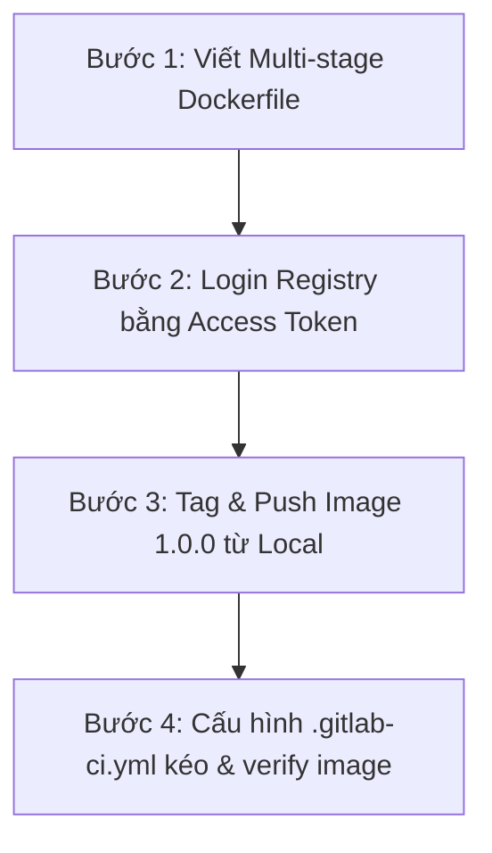

# PROMPT CHO GAMMA: ĐÓNG GÓI DOCKER IMAGE & ĐẨY LÊN REGISTRY (SESSION 8)

## 1. CONTEXT & ROLE
* **Role:** DevOps Architect kiêm Giảng viên cao cấp. Giọng điệu chuyên nghiệp, trực diện, đi thẳng vào bản chất kỹ thuật và thực tiễn vận hành hệ thống.
* **Target Audience:** Kỹ sư phần mềm, học viên đang phát triển dự án Spring Boot Microservices (hệ thống QuickBite).
* **Objective:** Giải thích quy trình tự động hóa đóng gói Docker image trong pipeline CI/CD, kỹ thuật tối ưu hóa Multi-stage build, quản lý phiên bản và vận hành GitLab Container Registry từ local đến môi trường tự động hóa CI/CD.

---

## 2. PARTITION INSTRUCTIONS
* **Số lượng slide khuyến nghị:** 15 - 20 slides.
* **Nguyên tắc phân bổ nội dung:**
  * **LESSON 01 (Mở đầu & Nền tảng):** Chuyển đổi từ đóng gói thủ công sang tự động hóa CI/CD. Phân tích mô hình DinD vs DooD.
  * **LESSON 02 (Tối ưu hóa):** Phân tích kỹ thuật Multi-stage build, tối ưu hóa kích thước image và vấn đề cache dependencies của Gradle.
  * **LESSON 03 (Đẩy Image từ Local):** Quy trình tương tác thủ công với GitLab Container Registry từ local terminal để hiểu bản chất xác thực và gắn tag.
  * **LESSON 04 (Kéo & Chạy trong CI/CD):** Tự động hóa kéo image từ Registry về Runner sử dụng Predefined Variables và verify ứng dụng.
  * **LESSON 05 (Thực hành tổng hợp):** Kịch bản thực hành từng bước cho dịch vụ `user-service`.
  * **Tính chuyên nghiệp:** Loại bỏ hoàn toàn các từ ngữ suồng sã, giật gân. Tập trung giải thích thuật ngữ kỹ thuật chính xác.

---

## 3. HIERARCHICAL OUTLINE (DÀN Ý CHI TIẾT)

### LESSON 01: Quy trình Build Docker image trong pipeline CI/CD

#### Slide 1: Bối cảnh - Hạn chế của quy trình đóng gói thủ công ở local
* **Quy trình thủ công cũ:**
  1. Biên dịch JAR trên máy phát triển bằng lệnh `./gradlew bootJar`.
  2. Đóng gói image tĩnh qua lệnh `docker build`.
* **Những hạn chế trong vận hành thực tế:**
  * *Không nhất quán môi trường:* Lệch phiên bản JDK giữa các máy lập trình viên (ví dụ máy chạy JDK 17, máy chạy JDK 21).
  * *Rủi ro thao tác:* Lập trình viên có thể quên build JAR mới trước khi chạy build image, dẫn đến đóng gói code cũ.
  * *Thiếu tự động hóa:* Không thể tích hợp vào luồng kiểm thử liên tục mỗi khi push code lên Git.
* **Giải pháp:** Thiết lập pipeline tự động hóa quy trình đóng gói qua 2 stage tuần tự trong GitLab CI/CD.

#### Slide 2: Kiến trúc Pipeline 2-Stage cơ bản
* Quy trình chuyển tiếp mã nguồn sang sản phẩm đóng gói:
```text
[ Git Push ] ──► [ Stage: build_jar ] ──(Lưu JAR artifacts)──► [ Stage: build_image ]
                                                                       │ (docker build)
                                                                       ▼
                                                              [ Single-stage Image ]
```
* **Stage 1: `build_jar`**
  * Khởi tạo container với môi trường JDK đầy đủ (`eclipse-temurin:17-jdk-alpine`).
  * Thực thi biên dịch mã nguồn Java ra file JAR và xuất ra dưới dạng **artifacts** lưu tạm thời trên GitLab Server.
* **Stage 2: `build_image`**
  * Khởi tạo container với Docker CLI (`docker:latest`).
  * Tải file JAR artifacts từ Stage 1 về và thực hiện lệnh `docker build`.

#### Slide 3: Giải pháp chạy Docker trong CI/CD: DinD vs DooD (Docker Socket Sharing)
* Để chạy được lệnh `docker build` bên trong container của job, có hai mô hình kiến trúc chính:
* **Docker-in-Docker (DinD):**
  * Chạy một Docker Daemon phụ độc lập bên trong container Runner thông qua `services: - docker:dind`.
  * *Nhược điểm:* Tốn thời gian khởi tạo container phụ, yêu cầu quyền privileged, không tận dụng được cache image của máy host.
* **Docker-outside-of-Docker (DooD) / Chia sẻ Docker Socket:**
  * Mount trực tiếp Docker socket vật lý của máy host (`/var/run/docker.sock`) vào container của job.
  * *Lợi ích:* Chuyển tiếp lệnh thực thi trực tiếp tới Docker daemon của máy host, tận dụng bộ nhớ cache layer có sẵn để tối ưu hóa tốc độ build, loại bỏ container phụ.

#### Slide 4: Thực hành cấu hình Pipeline 2-Stage mẫu
* Cấu hình tệp tin `.gitlab-ci.yml` sử dụng Local Runner và DooD:
```yaml
stages:
  - build_jar
  - build_image

build_jar_job:
  stage: build_jar
  image: eclipse-temurin:17-jdk-alpine
  tags:
    - quickbite
  script:
    - chmod +x ./gradlew && ./gradlew bootJar
  artifacts:
    paths:
      - build/libs/*.jar
    expire_in: 1 hour

build_docker_image_job:
  stage: build_image
  image: docker:latest
  tags:
    - quickbite
  variables:
    DOCKER_HOST: "unix:///var/run/docker.sock"
  script:
    - docker build -t user-service:latest .
```

---

### LESSON 02: Tối ưu hóa Dockerfile cho Production (Multi-stage build)

#### Slide 5: Điểm nghẽn của Pipeline 2-Stage truyền thống
* Mặc dù giải quyết được vấn đề tự động hóa, Pipeline 2-Stage bộc lộ 3 nhược điểm lớn:
  1. *Phụ thuộc băng thông:* Phải truyền tải file JAR nặng nề làm artifacts qua lại giữa GitLab Server và Runner.
  2. *Quy trình build không khép kín (Non-self-contained):* Dockerfile đơn tầng không tự biên dịch được. Lập trình viên không thể chạy lệnh `docker build` trực tiếp ở local nếu thiếu file JAR biên dịch sẵn.
  3. *Xung đột phiên bản:* Rủi ro lệch phiên bản JRE/JDK giữa lúc compile trên host và lúc chạy trong container.
* **Giải pháp:** Đưa toàn bộ bước biên dịch vào bên trong Dockerfile thông qua kỹ thuật **Multi-stage build**.

#### Slide 6: Khái niệm và Sơ đồ luồng Multi-stage Build
* Sử dụng nhiều chỉ thị `FROM` trong cùng một Dockerfile để chia quy trình thành các giai đoạn (stages) độc lập:
```text
[ Dockerfile Build ]
     │
     ├─► [ Stage 1: AS builder ] ──► (Tải Gradle, JDK, biên dịch JAR)
     │                                         │
     │                                 COPY --from=builder
     │                                         ▼
     └─► [ Stage 2: AS runner ]  ──► (Nhận JAR, dùng JRE Alpine) ──► [ Production Image ]
```
* **Stage 1 (Builder stage):** Sử dụng base image JDK đầy đủ để biên dịch mã nguồn.
* **Stage 2 (Runtime stage):** Sử dụng base image JRE siêu gọn nhẹ, sao chép file JAR thương phẩm từ Stage 1 sang (`COPY --from=builder`).
* *Kết quả:* Loại bỏ toàn bộ công cụ compile nặng nề và mã nguồn thô Java khỏi image cuối cùng, tối ưu dung lượng và bảo mật.

#### Slide 7: Thực hành viết Dockerfile Multi-stage & Tinh gọn Pipeline
* Cấu hình tệp `Dockerfile` của dịch vụ `user-service`:
```dockerfile
FROM eclipse-temurin:17-jdk-alpine AS builder
WORKDIR /app
COPY . .
RUN chmod +x ./gradlew && ./gradlew bootJar --no-daemon

FROM eclipse-temurin:17-jre-alpine
WORKDIR /app
COPY --from=builder /app/build/libs/*.jar app.jar
EXPOSE 8081
ENTRYPOINT ["java", "-jar", "app.jar"]
```
* Tệp `.gitlab-ci.yml` được tinh gọn chỉ còn 1 stage:
```yaml
image: docker:latest
stages:
  - build_image
build_docker_image_job:
  stage: build_image
  tags:
    - quickbite
  variables:
    DOCKER_HOST: "unix:///var/run/docker.sock"
  script:
    - docker build -t user-service:latest .
```

#### Slide 8: Pain Point mới - Vấn đề Cache Dependencies trong CI/CD
* **Nguyên nhân:**
  * Do tiến trình biên dịch diễn ra bên trong container builder tạm thời của lệnh `docker build`, Gradle không thể truy cập thư mục `.gradle` của máy host.
  * Mỗi lần chạy pipeline, Gradle bắt buộc phải tải lại toàn bộ thư viện dependencies từ Maven Central.
* **Hệ quả:**
  * Kéo dài thời gian chạy (runtime) của job lên tới **5-7 phút**.
  * Tiêu tốn băng thông mạng và tài nguyên hệ thống đáng kể.
* *Định hướng:* Cần tối ưu cấu hình cache cho các công cụ CI/CD chuyên nghiệp để giải quyết điểm nghẽn này.

---

### LESSON 03: Phiên bản hóa và Đẩy Docker Image lên Registry từ Local

#### Slide 9: Kiến trúc GitLab Container Registry
* **Định nghĩa:** GitLab Container Registry là kho lưu trữ Docker image riêng tư (private) đi kèm với từng dự án GitLab.
* **Cấu trúc đường dẫn Registry:**
  `registry.gitlab.com/<namespace>/<project_name>:<version_tag>`
  * Trong đó `<namespace>` là tên tài khoản hoặc group trên GitLab.
* **Quản trị trực quan:** Kiểm tra danh sách image đã đẩy lên thông qua giao diện Web của GitLab tại mục **Deploy** -> **Container Registry**.

#### Slide 10: Quy tắc đặt nhãn (Tagging) và Phiên bản hóa (Versioning)
* **Tầm quan trọng của Version Tag:**
  * Tránh sử dụng nhãn tĩnh `latest` cho môi trường Production vì dễ gây ghi đè ngoài ý muốn và không thể rollback khi lỗi.
  * Áp dụng quy tắc đánh phiên bản Semantic Versioning (ví dụ: `1.0.0`, `1.1.0`).
* **Lệnh gắn tag của Docker CLI:**
  ```bash
  docker tag <local_image> registry.gitlab.com/<namespace>/<project_name>:<version_tag>
  ```
  Lệnh này tạo ra một alias (bí danh) trỏ tới image nguồn, phục vụ cho việc định tuyến đẩy lên đúng kho chứa của dự án.

#### Slide 11: Xác thực bảo mật bằng Personal Access Token (PAT)
* Do kho lưu trữ Registry của GitLab mặc định là riêng tư (private), Docker CLI cần được xác thực quyền truy cập trước khi đẩy dữ liệu.
* **Nguyên tắc bảo mật:**
  * *Tuyệt đối không* sử dụng mật khẩu tài khoản chính của GitLab để đăng nhập từ terminal máy local.
  * Sử dụng **Personal Access Token (PAT)** được cấp quyền giới hạn: tích chọn quyền `write_registry` và `read_registry`.
* **Lệnh xác thực an toàn:**
  ```bash
  docker login registry.gitlab.com -u <gitlab_username>
  ```
  Nhập mã token PAT khi terminal yêu cầu cung cấp Password.

#### Slide 12: Quy trình Build & Push thủ công từ Local Terminal
* Chuỗi lệnh thực thi tại terminal máy phát triển cá nhân:
```bash
# 1. Đăng nhập hệ thống
docker login registry.gitlab.com -u <username>
# 2. Biên dịch nhanh chóng (tận dụng cache local)
./gradlew bootJar
# 3. Build Docker image
docker build -t user-service:1.0.0 .
# 4. Gắn nhãn Registry tương thích
docker tag user-service:1.0.0 registry.gitlab.com/<namespace>/user-service:1.0.0
# 5. Đẩy image lên cloud
docker push registry.gitlab.com/<namespace>/user-service:1.0.0
```
* **Lưu ý bảo mật:** Quy trình build và push từ máy local là một **anti-pattern** trong Production thực tế do dễ gây mất nhất quán mã nguồn (code chưa commit đã build thành image). Đây chỉ là bài thực hành sư phạm để sinh viên nắm vững nguyên lý hoạt động.

---

### LESSON 04: Sử dụng Docker Image từ Registry trong Pipeline CI/CD

#### Slide 13: Xác thực tự động trong CI/CD bằng Predefined Variables
* Khi chạy job trên Runner, không được khai báo cứng token cá nhân vào tệp cấu hình YAML. GitLab CI/CD tự động cấp phát tài khoản tạm thời có thời hạn ngắn thông qua các biến môi trường định sẵn:
  * `$CI_REGISTRY`: Địa chỉ máy chủ lưu trữ (mặc định: `registry.gitlab.com`).
  * `$CI_REGISTRY_USER`: Tên đăng nhập tạm thời do GitLab tự động sinh ra cho job.
  * `$CI_REGISTRY_PASSWORD`: Token xác thực tạm thời tương ứng với job (tự hủy khi job kết thúc).
  * `$CI_REGISTRY_IMAGE`: Đường dẫn Registry mặc định trỏ tới dự án hiện tại.

#### Slide 14: Thực hành cấu hình Pipeline Kéo và Verify Image
* Biên soạn tệp cấu hình `.gitlab-ci.yml` để thực hiện kéo image và khởi chạy kiểm thử tự động:
```yaml
image: docker:latest
stages:
  - test_image

test_docker_image_job:
  stage: test_image
  tags:
    - quickbite
  variables:
    DOCKER_HOST: "unix:///var/run/docker.sock"
  script:
    # 1. Xác thực tự động bằng tài khoản tạm thời của Runner
    - docker login -u $CI_REGISTRY_USER -p $CI_REGISTRY_PASSWORD $CI_REGISTRY
    # 2. Kéo image phiên bản 1.0.0 về Runner
    - docker pull $CI_REGISTRY_IMAGE:1.0.0
    # 3. Chạy thử container để verify ứng dụng
    - docker run -d --name verify_service -p 8081:8081 $CI_REGISTRY_IMAGE:1.0.0
    - sleep 5
    - docker ps
    # 4. Dọn dẹp môi trường trực tiếp trong script chính
    - docker rm -f verify_service
```

#### Slide 15: Tối ưu hiệu năng và Bảo mật thông tin trong CI/CD
* **Tối ưu hóa hiệu năng vượt trội:**
  * Job verify chỉ thực hiện các tác vụ mạng `pull` và chạy thử container, không biên dịch hay build image.
  * Thời gian thực thi cực kỳ ngắn (chỉ mất khoảng **10 - 15 giây** so với 5 phút khi build).
* **Bảo mật thông tin đăng nhập:**
  * Giá trị của biến `$CI_REGISTRY_PASSWORD` được GitLab tự động kiểm duyệt và ẩn đi dưới dạng chuỗi `[MASKED]` trên log console để tránh rò rỉ thông tin đăng nhập.

---

### LESSON 05: Kịch bản Thực hành Tổng hợp với user-service

#### Slide 16: Tóm tắt Kịch bản Thực hành Tổng hợp
* Quy trình thực hành toàn diện gồm 4 bước chính:

* **Mục tiêu thực hành:** Sinh viên tự tay cấu hình, thực hiện đẩy thành công image từ máy cá nhân lên registry dự án, và cấu hình pipeline CI/CD kiểm thử tự động kéo về chạy trên Local Runner.

#### Slide 17: Các lỗi thường gặp và giải pháp xử lý nhanh
* **Lỗi `denied: requested access to the resource is denied`:**
  * *Nguyên nhân:* Gõ sai đường dẫn Registry (sai namespace/tên dự án) hoặc Token PAT không đủ quyền.
  * *Khắc phục:* Kiểm tra lại URL hiển thị trên giao diện Deploy -> Container Registry của GitLab và tạo lại Token có đủ quyền `write_registry`.
* **Lỗi `Cannot connect to the Docker daemon` trong job CI/CD:**
  * *Nguyên nhân:* Local Runner thiếu cấu hình mount socket hoặc thiếu biến `DOCKER_HOST`.
  * *Khắc phục:* Bổ sung cấu hình volumes của Runner mẹ và khai báo biến `DOCKER_HOST: "unix:///var/run/docker.sock"` vào job.
* **Lạm dụng `after_script` để dọn dẹp:**
  * *Nguyên nhân:* Đưa lệnh `docker rm` vào `after_script`.
  * *Khắc phục:* Lỗi phát sinh trong `after_script` không được tính vào kết quả Passed/Failed của job. Hãy viết tất cả các bước (bao gồm cả dọn dẹp) vào khối `script` chính.
